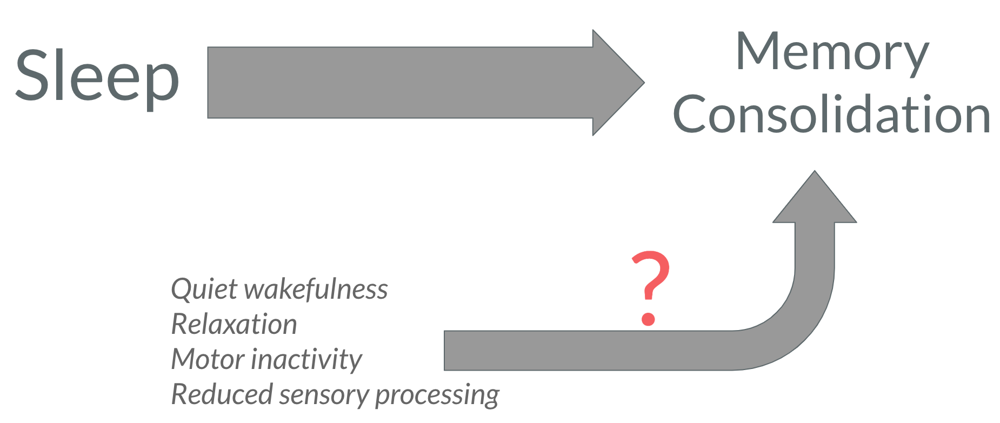
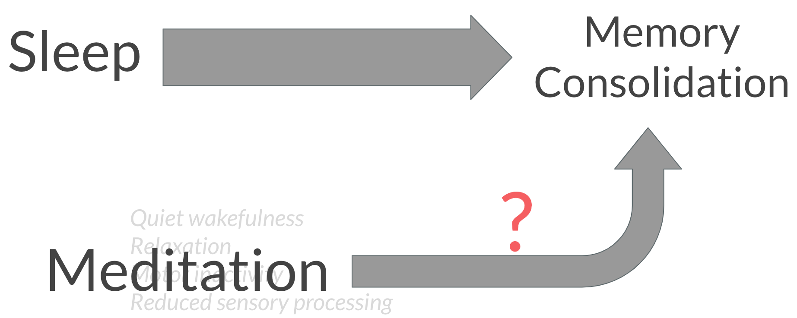
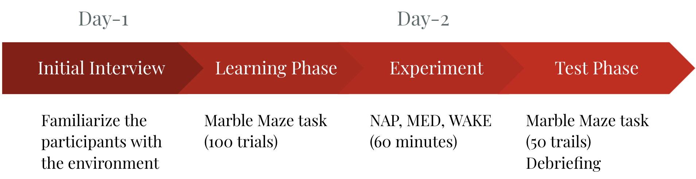
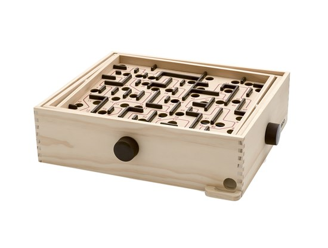
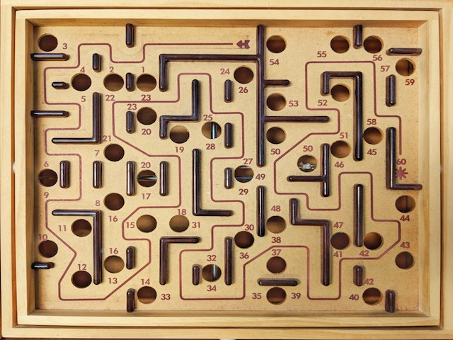
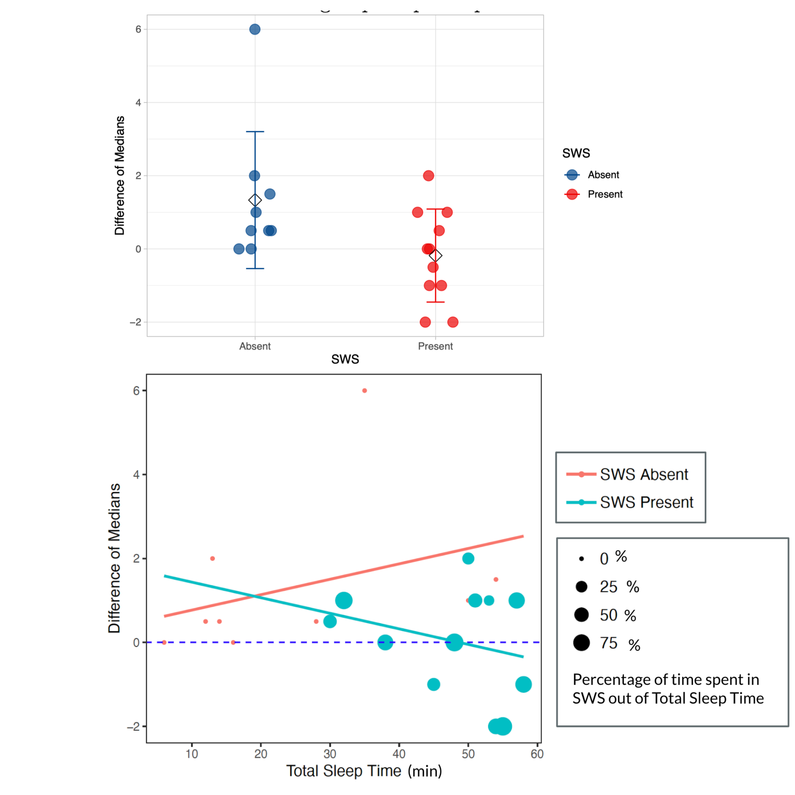
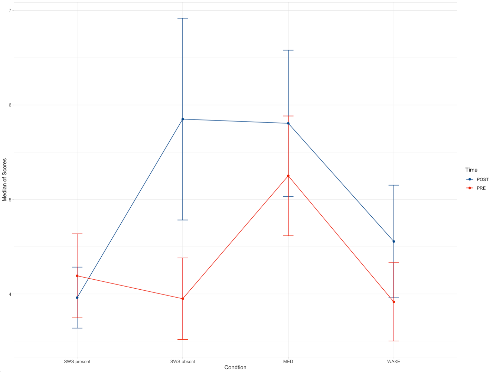

count:false
# A *Very* Brief Background

.font170[
- Sleep
    - non–REM and REM
    - non–REM: Stage 1, 2, SWS (deep sleep)
- Procedural memory
    - stimulus–response learning, acquisition of motor skills, etc.[1]
- Memory Consolidation
    - transforming information encoded during into a stable network of representation in the long-term memory
    - memories are "replayed"
    - sleep is great because the brain does not process incoming sensory information [2]
]

<style>

.center2 {
  margin: 0;
  position: absolute;
  top: 50%;
  left: 50%;
  -ms-transform: translate(-50%, -50%);
  transform: translate(-50%, -50%);
}


pre.sourceCode {
    max-height: 200px;
    overflow-y: auto;
}


/*
.remark-slide-number {
  position: inherit;
}

.remark-slide-number .progress-bar-container {
  position: absolute;
  bottom: 0;
  height: 4px;
  display: block;
  left: 0;
  right: 0;
}

.remark-slide-number .progress-bar {
  height: 100%;
  background-color: blue;
}
*/
</style>


```{css, echo=FALSE}
# CSS for including pauses in printed PDF output (see bottom of lecture)
@media print {
  .has-continuation {
    display: block !important;
  }
}

```


```{r setup, include=FALSE, cache=TRUE}
options(htmltools.dir.version = FALSE)
library(knitr)
opts_chunk$set(
  fig.align="center",  
  fig.height=4, #fig.width=6,
  # out.width="748px", #out.length="520.75px",
  dpi=300, #fig.path='Figs/',
  cache=T ,#, 
  echo=F #warning=F, message=F
  )
install.packages("hrbrthemes",repos = "http://cran.us.r-project.org")
library(tidyverse)
library(hrbrthemes)
library(fontawesome)

```

---

# Is memory consolidation exclusive to sleep?

```{r, echo=FALSE, out.width="90%"}
 
```
---
count:false
# Is memory consolidation exclusive to sleep?

```{r, echo=FALSE, out.width="90%"}
 
```
--
.font140[
**Hypothesis**: Participants in the NAP and MED conditions will outperform WAKE condition
]
---

# The Experiment

```{r, echo=FALSE, out.width="90%"}
 
```

.pull-left[
```{r,out.width='40%', echo=FALSE}

``` 
]
.pull-right[
```{r,out.width='40%', echo=FALSE}

``` 
]

--
.font80[
$Dependent Variable = [median\; of\; trials \; 1-10 \; of \; test \; phase]\; and\;  [median\; of\; trials \;trials \; 91-100 \; of \; learning \; phase]$
]
---

# Results
.pull-left[
```{r, out.width="100%", echo= FALSE, cache=TRUE}
library(ggpubr)
library(readxl)
library(readxl)
repeated_measures <- read_excel("repeated_measures.xlsx")

ggboxplot(repeated_measures, x = "Time", y = "MedianScores",
          color = "Condition", palette = "lancet",
          add = "jitter", 
          facet.by = "Condition", short.panel.labs = FALSE) 
```
]
--
.pull-right[
```{r, out.width="80%",echo=FALSE, fig.align='center'}
 knitr::include_graphics("https://c.tenor.com/JfFIxtoErUkAAAAC/frye-stare.gif")
```
]
--
.pull-right[
```{r,out.width='100%', echo=FALSE}

``` 
]

---
count:false
# Results
.pull-left[
```{r, out.width="100%", echo= FALSE, cache=TRUE}
library(ggpubr)
library(readxl)
library(readxl)
repeated_measures <- read_excel("repeated_measures.xlsx")

ggboxplot(repeated_measures, x = "Time", y = "MedianScores",
          color = "Condition", palette = "lancet",
          add = "jitter", 
          facet.by = "Condition", short.panel.labs = FALSE) 
```
]

.pull-right[
```{r,out.width='120%', echo=FALSE}

``` 
]
---
count:false
# Results

.font150[
- Mixed-design to ANOVA
    - 4 (condition) x 2 (time)
    - significant main effect of Time
        - $F(1,55)=6.648,\: p<.05,\: partial\:  \eta^{2} = .108$
    - no significant main effect of Condition
        - $F(3,55)=1.541,\: p=.214,\: partial\:  \eta^{2} = .078$
    - no significant Interaction
        - $F(3,55)=2.013,\: p=.123,\: partial\:  \eta^{2} = .099$
]
--
.pull-left[
```{r, out.width="55%",echo=FALSE, fig.align='center'}
 knitr::include_graphics("https://c.tenor.com/aFLo92uxk0UAAAAd/jim-halpert-the-office.gif")
```
]

---
count:false
# Results 

.pull-left[
.font140[
- Mixed-design to ANOVA
    - 4 (condition) x 2 (time)
    - significant main effect of Time
    - no significant main effect of Condition
    - no significant Interaction
- dividing the NAP into two conditions(?)
- *sleep inertia* [3,4]
]]


.pull-right[
```{r, cache=TRUE, echo=FALSE, out.width='100%', include=TRUE}
#
library(readxl)
library(ggsci)
library(rstatix)
mixed_design <- read_excel("mixed_design.xlsx")
ggline(mixed_design, x = "Condition", y = "MedianScores", color = "Time", add = c("mean_se") ) +
     xlab("Condtion")+
  ylab("Median of Scores") + theme_light() + scale_color_lancet()

```
]
]
---
# References

[1] Spencer, R. M., Walker, M. P., & Stickgold, R. (2017). Sleep and memory consolidation. Sleep disorders medicine, 205-223.    

[2] Diekelmann, S., & Born, J. (2010). The memory function of sleep. Nature Reviews Neuroscience, 11(2), 114-126.    

[2] Chokroverty, S., Bhat, S., & Allen, R. P. (2017). Motor control and dyscontrol in sleep. In Sleep disorders medicine (pp. 713-757). Springer, New York, NY.    

[3] Hilditch, C. J., Dorrian, J., & Banks, S. (2017). A review of short naps and sleep inertia: do naps of 30 min or less really avoid sleep inertia and slow-wave sleep?. Sleep medicine, 32, 176-190.
---


class: inverse, center, middle

# .font140[ Thank You]


<html><div style='float:left'></div><hr color='#EB811B' size=1px width=100%></html>

.font190[
<mdast003@ucr.edu>
]
